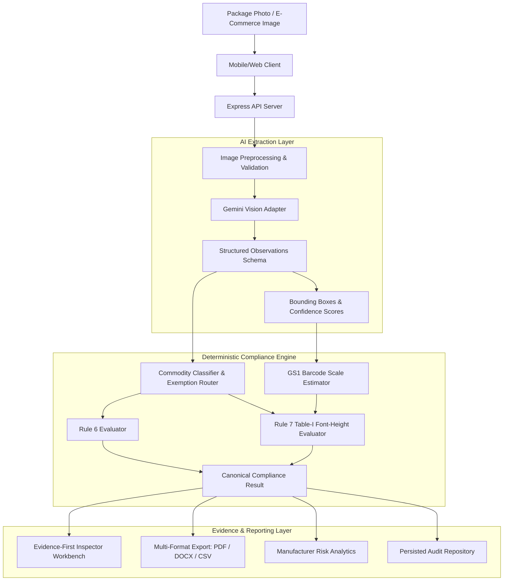

# मानक | MAANAK
### Digital Compliance Screening for Packaged Commodities

[](https://www.sih.gov.in/)
[](https://www.sih.gov.in/)
[](https://consumeraffairs.nic.in/)
[](#testing)
[](#disclaimer)

---

## 📌 Executive Summary

**मानक (Maanak)** is an AI-assisted, evidence-first digital compliance screening system engineered for Legal Metrology enforcement officials. Built for **Smart India Hackathon 2026 (Problem Statement SIH26034)**, Maanak streamlines the preliminary screening of physical packaged commodities and e-commerce product listings against the **Legal Metrology (Packaged Commodities) Rules, 2011 (LMPC)**.

Traditional compliance inspection is manual, laborious, and impossible to scale across millions of fast-moving consumer goods. Maanak equips enforcement inspectors with instant, reliable, and legally traceable digital screening directly from a mobile camera or web browser.

---

## 🏛️ Core Architectural Principle

```
┌─────────────────┐       ┌─────────────────┐       ┌─────────────────┐
│   AI OBSERVES   │  ──▶  │  RULES DECIDE   │  ──▶  │EVIDENCE EXPLAINS│
└─────────────────┘       └─────────────────┘       └─────────────────┘
  Computer Vision           Deterministic Law        Cryptographic Trail
  Structured Extract        Versioned Statutes        Auditable BBoxes
```

1. **AI Observes**: Multimodal vision models (Google Gemini) extract visible declarations, text, bounding boxes, and scale references. **AI never issues a legal verdict.**
2. **Rules Decide**: A deterministic, versioned legal rule engine evaluates compliance against codified statutes (Rule 6, Rule 7, Rule 26 exemptions).
3. **Evidence Explains**: Every finding links directly back to the original uncompressed source photograph, pixel coordinates (bounding boxes), OCR confidence, and statutory citations.

---

## ⚖️ The 5-State Deterministic Compliance Model

Maanak rejects naive binary (Pass/Fail) assumptions. Real-world enforcement requires handling physical ambiguities honestly:

| State | Status Definition | Real-World Application |
|---|---|---|
| <kbd>**PASS**</kbd> | Declaration detected, verified, and complies with statutory specifications. | MRP formatted with currency symbol, Net Qty in legal units, complete manufacturer address. |
| <kbd>**FAIL**</kbd> | Mandatory declaration missing, truncated, or in direct violation of statutory rules. | Consumer care phone/email omitted, expiry date missing, font size below statutory minimum. |
| <kbd>**UNCERTAIN**</kbd> | Text obscured, blurred, low confidence, or glare present. Never guesses. | Torn label, curved reflection; flagged for human inspector confirmation. |
| <kbd>**NOT_APPLICABLE**</kbd> | Statutory exemption applies under the LMPC Rules, 2011. | Small packages $\le 10\,\text{g}/10\,\text{ml}$ (Rule 26), fast food / hotel items, industrial bulk packages $> 25\,\text{kg}$. |
| <kbd>**NOT_MEASURABLE**</kbd> | Physical measurement requires a verified scale reference not present in the photo. | Font height check without a reference scale or GS1 barcode; prevents fabricated measurements. |

> **Zero Hallucination Guarantee:** If an image is obscured or lacks a physical reference, Maanak will **never** guess or hallucinate a legal pass.

---

## ✨ Key Capabilities & Features

### 🔍 1. Multi-Modal Vision Extraction
- **Mobile-First Capture**: Seamless camera capture on mobile devices (`capture="environment"`) and desktop file uploads.
- **Physical Labels & E-Commerce**: Analyzes physical retail packaging or e-commerce listing screenshots with specialized extraction pipelines.
- **Bounding Box Localization**: Maps every declaration (MRP, Net Qty, Batch No, Best Before, Consumer Care, Manufacturer details) to exact pixel coordinates.

### 📜 2. LMPC Rules 2011 Statutory Engine
- **Rule 6 Mandatory Declarations**: Validates presence, formatting, completeness, and unit standards for all 8 mandatory label declarations.
- **Rule 7 Font-Height Table-I Compliance**: Dynamic font height checking keyed to Net Quantity tiers ($< 50\,\text{cm}^2$, $50\text{--}100\,\text{cm}^2$, $100\text{--}500\,\text{cm}^2$, $500\text{--}2500\,\text{cm}^2$, $\ge 2500\,\text{cm}^2$).
- **Aspect Ratio Validation**: Enforces Rule 7(3) character width requirement ($\text{width} \ge \text{height} / 3$).
- **Statutory Exemption Routing**: Automatic classification of packages under Rule 26 (small sachets, agricultural produce $> 50\,\text{kg}$, institutional packages).

### 📏 3. GS1 Barcode Scale Reference Calibration
- Detects standard GS1 EAN-13 barcodes on packaging.
- Uses nominal physical dimensions ($37.29\,\text{mm} \times 25.93\,\text{mm}$) to calibrate pixel-to-millimeter ratios.
- Clearly flags scale estimations with explicit assumptions, confidence ratings, and limitations.

### 📄 4. Multi-Format Report Generation
- **Tamper-Evident PDF Reports**: Clean, branded screening summaries with digital disclaimers, metadata, and visual evidence callouts.
- **Editable DOCX Notices**: Pre-populated Word documents for enforcement officers to draft legal inspection notices or memos quickly.
- **Tabular CSV Export**: Bulk findings and rule citations for case management integration.

### 🛡️ 5. Role-Based Access Control (RBAC) & Audit Trail
- **Two Distinct Roles**:
  - **Inspector**: Perform scans, review evidence, inspect workbench cases, export reports.
  - **Supervisor / Admin**: Access system audit logs, configure rules, review inspector activity, manage organization settings.
- **Immutable Audit Logging**: Every scan creation, review action, and report export is timestamped and cryptographically logged.

### 📊 6. Manufacturer & Brand Trend Analytics
- Tracks historical non-compliance rates across manufacturers and brands.
- Identifies repeat offenders and recurring statutory violations (e.g., repeatedly missing consumer care details).
- Visual distribution charts and risk indicators for data-driven market surveillance.

---

## 🏗️ System Architecture & Data Flow



---

## 📁 Repository Structure

```
maanak/
├── README.md                           # Main project documentation (this file)
├── AGENTS.md                           # Operational constraints & AI agent rules
├── render.yaml                         # Cloud deployment blueprint (Render)
├── .gitignore                          # Git ignore rules
│
├── docs/                               # Architectural & statutory references
│   ├── DECISIONS.md                    # Core architectural decisions (D-001 to D-012)
│   ├── REAL_PRODUCT_VALIDATION.md      # Matrix of real package photography edge cases
│   ├── REAL_PRODUCT_VALIDATION_TEMPLATE.csv
│   ├── design/                         # UI/UX design specifications & screenshots
│   │   ├── DESIGN_REFERENCE.md         # Canonical design system & palette reference
│   │   ├── architecture-diagram.html   # Interactive presentation architecture diagram
│   │   └── screens/                    # High-resolution prototype screenshots
│   ├── legal_corpus/                   # Official gazette and rules documentation
│   │   └── lmpc_rules_2011_consolidated_dca.pdf
│   └── spec/                           # Canonical product & functional specifications
│       ├── PRODUCT_SPEC.md             # Primary product specifications & requirements
│       ├── COMPLIANCE_ENGINE_SPEC.md   # Deterministic rule engine specifications
│       ├── FUNCTIONAL_SPEC.md          # Functional behavior & edge case requirements
│       ├── INNOVATION_SPEC.md          # Scale calibration & innovation features
│       ├── LEGAL_RESEARCH_STATUS.md    # Statutory grounding & legal verification notes
│       ├── PRODUCT_SCOPE.md            # Scope boundaries & target user profiles
│       ├── UX_SPEC.md                  # Screen-by-screen UX specifications
│       └── DEMO_SPEC.md                # Demonstration narrative & live test criteria
│
└── prototype/                          # Full-stack implementation
    ├── package.json                    # Dependencies & build scripts
    ├── vite.config.ts                  # Vite build configuration
    ├── server/                         # Express API & Server Services
    │   ├── index.ts                    # Server entrypoint
    │   ├── app.ts                      # Express routing & controllers
    │   ├── auth.ts                     # RBAC authentication & audit trail
    │   ├── repository.ts               # Persisted scan storage & analytics store
    │   ├── app.test.ts                 # API & RBAC test suite
    │   └── repository.test.ts          # Storage & analytics test suite
    └── src/                            # Frontend Application (React 19 + Tailwind v4)
        ├── App.tsx                     # Main application shell & navigation
        ├── domain/                     # Canonical domain types & models
        ├── extraction/                 # Gemini AI vision extraction adapter
        ├── evaluation/                 # LMPC Rule 6 & Rule 7 deterministic evaluators
        ├── measurement/                # Barcode scale estimation & dimension logic
        ├── reports/                    # PDF, DOCX, and CSV report generators
        ├── analytics/                  # Manufacturer risk scoring & trends
        ├── components/                 # Workbench, dashboard, modal, & evidence UI
        └── validation/                 # Real-product validation matrices & test harness
```

---

## 🛠️ Technology Stack

| Layer | Technologies |
|---|---|
| **Frontend** | React 19, TypeScript, Tailwind CSS v4, Lucide Icons, Motion |
| **Backend** | Node.js, Express, TypeScript (`tsx` runtime) |
| **AI / Vision** | Google Gemini 2.0 / 2.5 Flash via `@google/genai` SDK |
| **Report Generation** | jsPDF, jspdf-autotable (PDF), Custom OpenXML Zip packaging (DOCX) |
| **Build & Tooling** | Vite 6, TypeScript Compiler (`tsc`) |
| **Deployment** | Cloud-native blueprint on Render (`render.yaml`) |

---

## 🚀 Getting Started

### Prerequisites
- **Node.js**: v18.0.0 or higher
- **npm** or **bun**
- **Google Gemini API Key**: Obtainable from [Google AI Studio](https://aistudio.google.com/)

### 1. Clone the Repository
```bash
git clone https://github.com/ayushzodape/maanak.git
cd maanak/prototype
```

### 2. Install Dependencies
```bash
npm install
```

### 3. Configure Environment Variables
Create a `.env` or `.env.local` file inside `prototype/`:
```env
PORT=3001
VITE_API_BASE_URL=http://localhost:3001
GEMINI_API_KEY=your_gemini_api_key_here
SESSION_SECRET=your_secure_random_session_secret
```

### 4. Run Development Servers
In separate terminal windows or run together:

**Start the API Server:**
```bash
npm run server
```

**Start the Frontend Client:**
```bash
npm run dev
```

Open [http://localhost:3000](http://localhost:3000) in your browser.

---

## 🧪 Testing

Maanak includes a comprehensive automated test suite covering deterministic rule boundaries, commodity classifications, scale estimation, report generation, RBAC security, and API integrity.

To execute the test suite:
```bash
npm test
```

```
✔ creates and retrieves a scan with validated metadata
✔ enforces RBAC permissions: inspector denied admin audit logs, supervisor granted access
✔ verified declaration rules deterministically pass observed evidence
✔ blocked Rule 7 never evaluates a legal verdict and never uses PDP-area logic
✔ NOT_MEASURABLE remains NOT_MEASURABLE and cannot become PASS
✔ SMALL_SACHET commodity category deterministically exempts MRP and consumer care
✔ INDUSTRIAL_BULK commodity category deterministically exempts retail MRP under Rule 3
✔ renderPdfReport generates valid PDF byte stream with metadata and sections
✔ renderDocxReport generates valid DOCX OpenXML zip stream
✔ renderCsvReport generates valid tabular CSV with disclaimer and findings
...
ℹ tests 96 | pass 96 | fail 0
```

---

## ☁️ Production Deployment

The project includes a ready-to-use Render Blueprint ([render.yaml](render.yaml)).

To deploy:
1. Connect your GitHub repository to [Render](https://render.com/).
2. Select **Blueprints** and point to `render.yaml`.
3. Configure the `GEMINI_API_KEY` secret variable in the Render Dashboard.
4. Render will automatically build the React bundle and deploy the Express API server.

---

## ⚖️ Legal & Screening Disclaimer

> [!WARNING]
> **Digital Compliance Screening Notice**
> 
> **Maanak is a decision-support preliminary screening system**, designed to assist authorized enforcement officials. 
> 
> - Maanak is **not** an official government inspection certificate or legal determination.
> - Maanak does **not** replace the statutory discretion of an authorized Legal Metrology Officer.
> - Physical dimensions and font heights estimated without verified calibration references are designated **`NOT_MEASURABLE`** or screening estimates only.
> - Any formal enforcement, notice issuance, or prosecution under the Legal Metrology Act, 2009 must follow physical inspection and statutory procedure.

---

<div align="center">
  <sub>Developed with pride for <b>Smart India Hackathon 2026</b> • Problem Statement SIH26034</sub><br>
  <sub>Ministry of Consumer Affairs, Food & Public Distribution • Government of India</sub>
</div>
